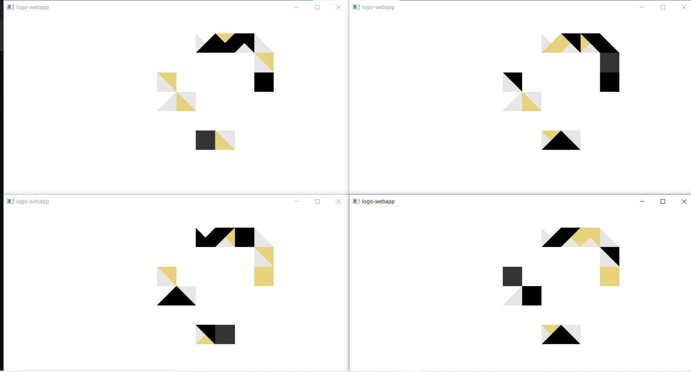

## logo webapp 
### salvat (Tobiáš Salva)

Omlouvám se za nedodřržení deadlinu, hrozně se mi do toho úkolu nechtělo, dělal jsem to an poslendí chvíli s tím, 
že to one-bangnu s AI. Ale pak mě to samzřejmě začalo bavit, a stávil jsem s tím 3 dny. Pak už mi připadalo lepší to prostě udělat než psát a omlouvat se že se zdržím...

Nesplnil jsem v zadání to, že client na konci pošle 'Quit'. Je to tak pro to, že gloss::playIO nejde nijak normálně ukončit,
musí se to dělat přes 'exitSuccess' nebo podobné, což už nenechá žádné vlákno nic udělat
 a prostě to kompletně celou aplikaci okamžitě zabije.

Přidat poslání této finální zprávy do samotného eventu, který hru ukončuje, mi zase přijde jako hrozné narušení nějaké rozumné dekomozice - 
gloss nemá vědět nic o tom co se děje mimo canvas, natož aby sám posílal zprávy někam přes socket.

Takhle to vypadá pro více klientů, nějaké složitější renderování jsem neřešil...

